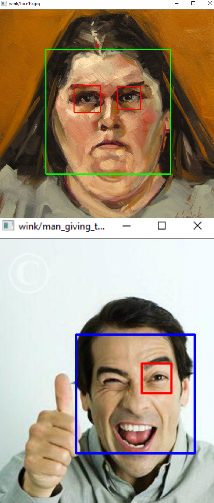

# 2018 Spring Computer Vision CS6384
Instructor: **Dr. Haim Schweitzer**

This course focuses on the basics of computer vision. The topics include pixel techniques, neighborhood techniques, object recognition, perspective geometry, motion, etc.

## What's inside the folder
- folder `proj1` and `proj2` contain the source code and documentations for project1 and project2 of this course

- `Project1.pdf` and `Project2.pdf` are the requirements of the projects

## How to run
Please refer to the readme file of each prject folder.

### Project1: Image Processing
Python / OpenCV3 / Desktop Application

It is a practice of the image optimization and transformation of the color systems: using OpenCV and tools provided by Python to manipulate the pixels in an image, following the liner scale and histogram equalization methods to optimize the image.

Please refer to the requirements of the project and the report in the project folder for detail.

### Project2: Wink detection and Shush detection
Python / OpenCV3 / Desktop Application

Following the object detection method proposed by Paul Viola and Michael Jones, and using the cascade classifiers provided by OpenCV, to detect faces, eyes and mouths. The goal is to obtain a best detection result on the given input.

Please refer to the requirements of the project and the documentation in the project folder for detail.

Wink Detection:  

Shush Detection:  

